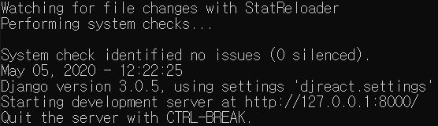
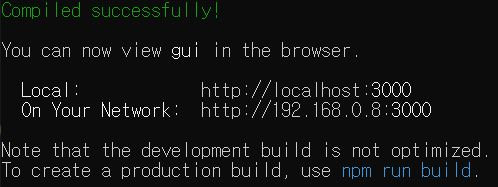
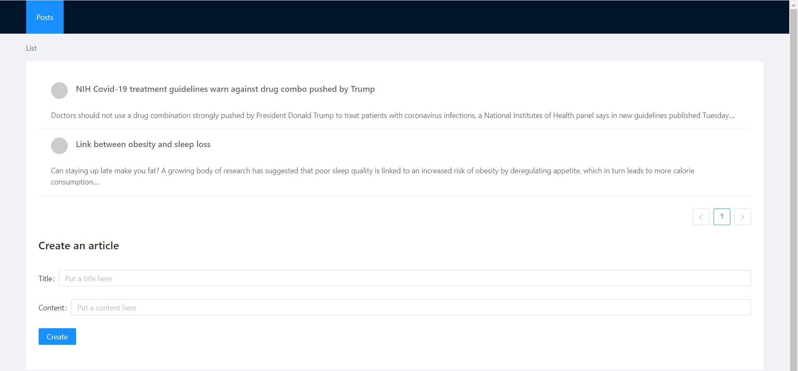
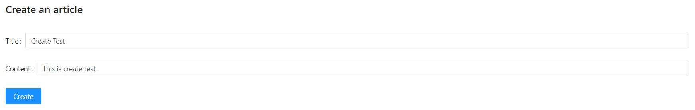
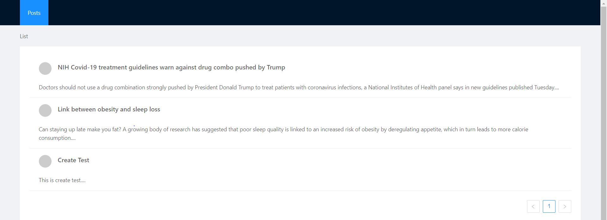
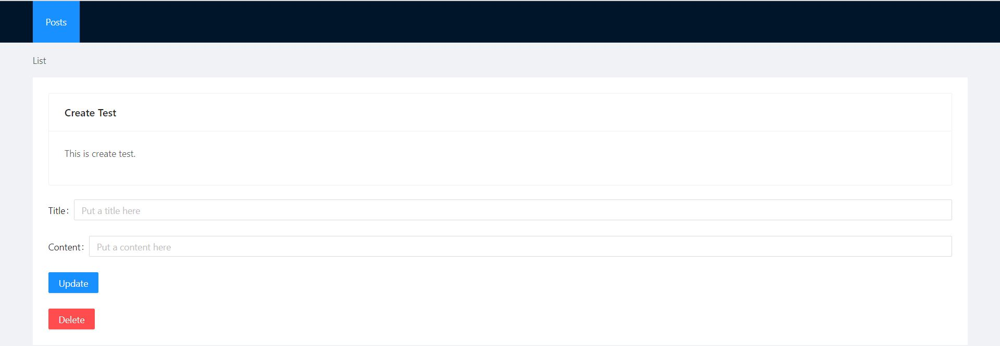
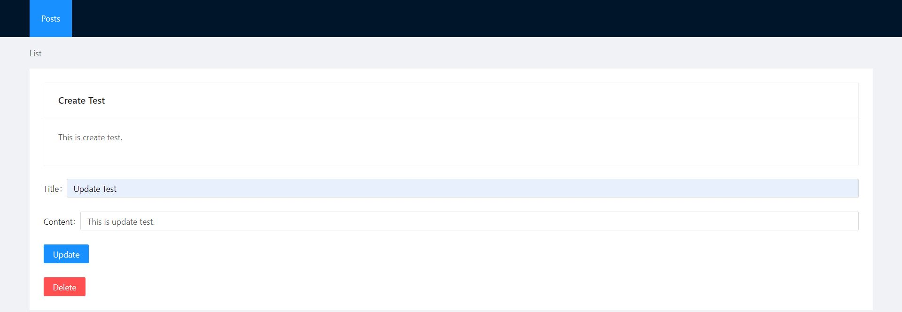
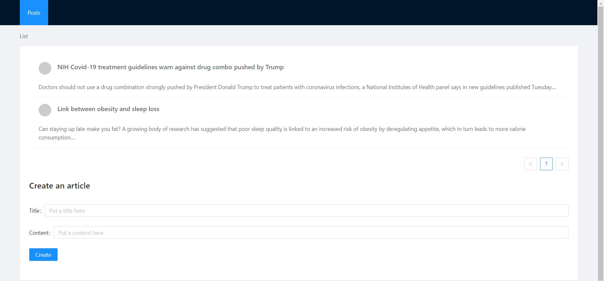

# 휴먼스케이프 사전과제 리드미

## 개요

- 본 프로젝트는 휴먼스케이프 사전과제로 간단한 CRUD 형식의 게시판을 django와 react로 구현한 내용을 담고 있음.
- 사전과제를 구현함에 앞서 주체적으로 원하는 기능을 구현하기에 어려움을 겪어 tutorial을 기반으로 진행함.  
[Django and React tutorial](https://www.youtube.com/watch?v=uZgRbnIsgrA&t=1490s)

## 프로젝트 시행

### 세팅

- 본 프로젝트는 Windows OS 기반으로 구현되어 있어 Windows OS 상에서의 구현을 권장함.
- python, pip, virtualenv가 설치되어 있지 않다면 설치해야 함.

### 실행(backend)

- HSstudy2 directory에서 아래외 같이 입력.  
```HSstudy2>cd backend\env\Scripts\```
- Scripts directory에서 아래와 같이 입력.  
```HSstudy2\backend\env\Scripts>activate```
- 아래와 같이 나타나면 성공.  
```(env) HSstudy2\backend\env\Scripts>```
- 위와 같은 디엑토리에서 아래와 같이 입력.  
```(env) HSstudy2\backend\env\Scripts>cd ../../src```
- Scripts directory에서 아래와 같이 입력.  
```(env) HSstudy2\backend\src>python manage.py runserver```  
- 아래와 같이 나타나면 성공.



### 실행(frontend)

- HSstudy2 directory에서 아래외 같이 입력.  
```HSstudy2>cd frontend\gui\```
- Scripts directory에서 아래와 같이 입력.  
```HSstudy2\frontend\gui>npm start```
- 아래와 같이 나타나면 성공.



## 결과 확인 및 구현 기능

### 결과 확인

- http://localhost:3000/ 에 접속하여 확인.
- 아래와 같이 기본 페이지가 나타나면 성공.


### 구현 기능

#### 1. Create
- 기본 페이지에서 Create an article 밑의 Title과 Content 항목을 채워 넣고 Create 버튼을 누르면 article이 생성.

 Create article 창

 새 article이 생성된 모습

#### 2. Read
- 기본 페이지에서 생성된 article의 title을 클릭하면 새로운 페이지로 이동되면서 full article을 읽을 수 있음.
 Full ariticle 창으로 이동된 모습

#### 3. Update
- Full aritlce 페이지에서 하단의 title과 content에 항목을 채워 넣고 update를 누르면 article을 update할 수 있음.

 Update를 시도하는 모습

 내용이 update된 모습

#### 4. Delete
- Full aritlce 페이지에서 하단의 delete를 누르면 article이 삭제됨.

 article이 삭제된 모습

## 어려웠던 점, 새로웠던 점

- javascript, react, django 모두 처음 다뤄보는 것이어서 학습의 방향을 잡기 힘들어 tutorial을 진행했다. 친절하게 어떤 것이 무슨 역할을 하는지 알 수는 없었지만 모르는 것들을 구글링해가며 전반적인 구조와 역할들을 머릿속에 자리매김할 수 있었다. 현재는 Henry가 추천해준 react 교재로 학습 중이며 만족하고 있다.

- 페이지의 항목들을 구성함에 있어 시작하기도 어려웠는데 [ant design](https://ant.design/)이라는 곳에서 기본적인 react design의 틀을 제공한다는 점을 새롭게 알게 되었고, 구성된 디자인을 가져와서 적용함으로써 나름 쉽게 적용할 수 있었다.

- ant design에서 제공하는 특정 javascript가 일부 바뀌어 tutorial에서 사용하는 것이 작동하지 않았던 경우가 있었다. 막막했으나, 비슷한 경험을 한 다른 사람들의 의견을 바탕으로 수정을 통해 해결할 수 있었다.
